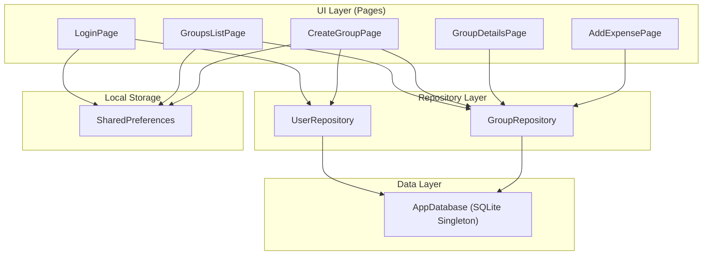
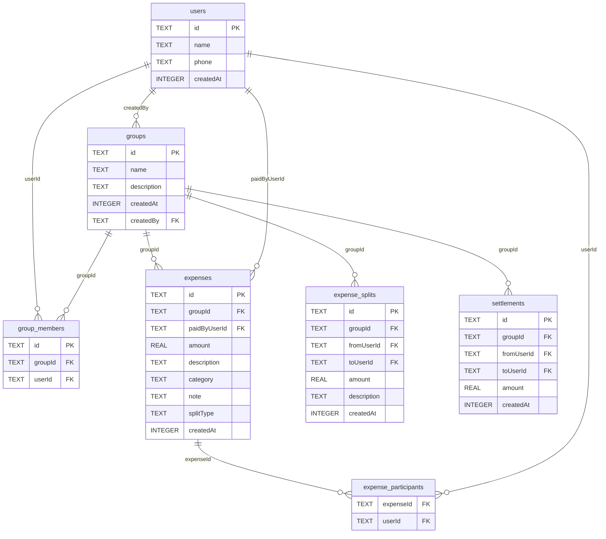
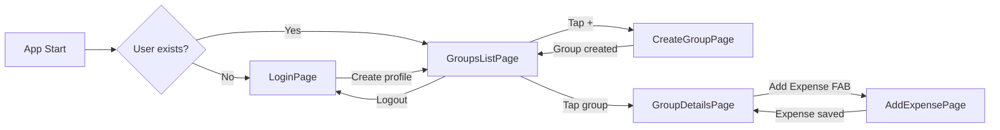
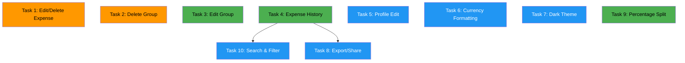

# Expense Splitter — Architecture & Implementation Plan

> Complete reference for any AI model or developer to understand, navigate, and extend this project.

---

## 1. Project Overview

**Expense Splitter** is a Flutter mobile/desktop app (no web support) for splitting expenses among friends. Users create **groups** (called "Events"), add **expenses** with equal or unequal splits, and the app computes **settlements** (who owes whom) using a greedy debt-simplification algorithm.

**Tech Stack:**
- **Flutter 3.47.5** / Dart 3.13.4, Material 3
- **SQLite** via `sqflite` (mobile) and `sqflite_common_ffi` (desktop)
- **SharedPreferences** for session (current user ID)
- **UUID** for primary keys
- No state management library (uses `StatefulWidget` + `FutureBuilder`)
- No dependency injection framework (manual instantiation)

---

## 2. Current File Structure

```
lib/
├── main.dart                          # Entry point, platform init, routing
├── database/
│   └── database.dart                  # SQLite singleton, schema, migrations
├── models/
│   ├── group.dart                     # Group, GroupBalanceView, ExpenseSplit
│   ├── expense.dart                   # Expense, ExpenseParticipant, categories, stats models
│   ├── settlement.dart                # Settlement, GroupMember
│   └── friend_input.dart              # FriendInput (create-group form DTO)
├── repositories/
│   ├── user_repository.dart           # User CRUD + User model class
│   └── group_repository.dart          # Group CRUD, expenses, settlements, stats
└── pages/
    ├── login_page.dart                # Name/phone profile creation
    ├── groups_list_page.dart           # Home: overall balance + group list
    ├── create_group_page.dart          # Create event with friends
    ├── group_details_page.dart         # Event detail: settlements + stats
    └── add_expense_page.dart           # Add expense: equal/unequal split
```

---

## 3. Architecture Diagram



---

## 4. Database Schema (v4)



---

## 5. Navigation Flow



---

## 6. Core Business Logic

### 6.1 Settlement Calculation Algorithm
Located in [`group_repository.dart`](file:///home/deval/Projects/expense-splitter/lib/repositories/group_repository.dart#L328-L463) — `calculatePendingSettlements()`.

**Algorithm (Greedy Debt Simplification):**
1. Initialize balance = 0 for every group member
2. For each expense: payer gets `+(amount - share)`, each other participant gets `-share`
3. Apply existing settlements: payer balance `+amount`, receiver balance `-amount`
4. Separate into **creditors** (balance > 0) and **debtors** (balance < 0)
5. Sort both descending by absolute amount
6. Greedily match: debtor pays creditor `min(debtorOwes, creditorOwed)`
7. Result: minimal list of settlements

### 6.2 Expense Split Types
- **Equal**: Amount ÷ number of selected participants
- **Unequal**: Each participant's consumption entered manually; remainder auto-distributed to empty fields

### 6.3 Balance Calculation
[`getUserNetBalanceForGroup()`](file:///home/deval/Projects/expense-splitter/lib/repositories/group_repository.dart#L160-L203):
```
net = credit - debit - settlement_in + settlement_out
```
Where credit/debit come from `expense_splits` table and settlements from `settlements` table.

> [!WARNING]
> The `expense_splits` table is populated during group creation (initial payments) but the `addExpense()` method does NOT write to it. Balance calculation for new expenses uses the settlement algorithm directly from `expenses` + `expense_participants` tables. This is a known inconsistency in the current code.

---

## 7. Key Models Reference

| Model | File | Purpose |
|-------|------|---------|
| `User` | `repositories/user_repository.dart:4` | App user with name, phone, timestamps |
| `Group` | `models/group.dart:1` | Event/group with name, description, creator |
| `GroupBalanceView` | `models/group.dart:37` | Group + calculated net balance for display |
| `Expense` | `models/expense.dart:2` | Single expense with payer, amount, participants |
| `ExpenseParticipant` | `models/expense.dart:105` | Join record: expense ↔ user |
| `Settlement` | `models/settlement.dart:2` | Payment from one user to another |
| `GroupMember` | `models/settlement.dart:88` | User + total amount paid in group |
| `FriendInput` | `models/friend_input.dart:1` | DTO for create-group form |
| `MemberExpenseStats` | `models/expense.dart:136` | Per-member paid/owed/net for stats |
| `GroupExpenseStats` | `models/expense.dart:152` | Aggregate stats: count, total, categories, members |

---

## 8. What's Already Working ✅

- [x] User profile creation (name + optional phone)
- [x] Session persistence via SharedPreferences
- [x] Group creation with multiple friends + initial payments
- [x] Group list with per-group and overall balance
- [x] Add expense with equal or unequal split
- [x] Expense categories and notes
- [x] Settlement calculation (greedy debt simplification)
- [x] Mark settlement as paid
- [x] Expense insights: category breakdown, member net position
- [x] Desktop support (Windows, macOS, Linux via FFI)
- [x] Web fallback page
- [x] Database migrations (v1 → v4)
- [x] Clean analysis (0 issues)

---

## 9. Remaining Features to Build 🚀

Below are the features that still need to be implemented, broken into **self-contained tasks** that any small model can pick up independently.

---

### Task 1: Edit / Delete Expense
**Priority:** High · **Complexity:** Medium · **Files to modify:** 2-3

**What:** Users need to edit or delete expenses they've added.

**Steps:**
1. Add `updateExpense()` and `deleteExpense()` methods to [`group_repository.dart`](file:///home/deval/Projects/expense-splitter/lib/repositories/group_repository.dart)
   - `deleteExpense(String expenseId)` — Delete from `expenses` and `expense_participants` tables in a transaction
   - `updateExpense(...)` — Delete old participants, update expense row, re-insert participants in a transaction
2. In [`group_details_page.dart`](file:///home/deval/Projects/expense-splitter/lib/pages/group_details_page.dart), add an "Expenses" section listing all expenses with swipe-to-delete or a delete icon
3. Add a way to navigate to [`add_expense_page.dart`](file:///home/deval/Projects/expense-splitter/lib/pages/add_expense_page.dart) in "edit mode" — pre-fill form fields from existing `Expense` object

**Constraints:**
- Use `db.transaction()` for atomicity
- After delete/edit, call `_loadGroupData()` to refresh settlements

---

### Task 2: Delete Group
**Priority:** High · **Complexity:** Low · **Files to modify:** 2

**What:** Users should be able to delete a group/event.

**Steps:**
1. Add `deleteGroup(String groupId)` to [`group_repository.dart`](file:///home/deval/Projects/expense-splitter/lib/repositories/group_repository.dart)
   - In a transaction, delete from: `settlements`, `expense_participants` (via join on expenses), `expense_splits`, `expenses`, `group_members`, `groups` — in that order
2. In [`groups_list_page.dart`](file:///home/deval/Projects/expense-splitter/lib/pages/groups_list_page.dart), add long-press or swipe-to-delete on group cards with a confirmation dialog
3. Call `_refreshData()` after deletion

---

### Task 3: Edit Group (Rename / Add Members)
**Priority:** Medium · **Complexity:** Medium · **Files to modify:** 2-3

**What:** Allow renaming a group and adding new members to existing groups.

**Steps:**
1. Add `updateGroupName(String groupId, String newName)` to [`group_repository.dart`](file:///home/deval/Projects/expense-splitter/lib/repositories/group_repository.dart)
2. Add `addNewMemberToGroup(String groupId, String name, String? phone)` — creates user if needed, adds to `group_members`
3. Create an "Edit Group" page or dialog accessible from [`group_details_page.dart`](file:///home/deval/Projects/expense-splitter/lib/pages/group_details_page.dart) via an AppBar action

---

### Task 4: Expense History Timeline
**Priority:** Medium · **Complexity:** Low · **Files to modify:** 1-2

**What:** Show a chronological feed of all expenses and settlements in a group.

**Steps:**
1. Create a new page `lib/pages/expense_history_page.dart`
2. Fetch expenses via `getGroupExpenses()` and settlements via `getGroupSettlements()` from [`group_repository.dart`](file:///home/deval/Projects/expense-splitter/lib/repositories/group_repository.dart)
3. Merge and sort by `createdAt` descending
4. Display as a `ListView` with cards showing: description, amount, payer, date, category chip
5. Add a navigation button in [`group_details_page.dart`](file:///home/deval/Projects/expense-splitter/lib/pages/group_details_page.dart) AppBar

---

### Task 5: User Profile Edit
**Priority:** Low · **Complexity:** Low · **Files to modify:** 2

**What:** Allow user to edit their name and phone after initial setup.

**Steps:**
1. Create `lib/pages/profile_page.dart` with form fields pre-filled from `UserRepository.getUserById()`
2. Use existing `updateUser()` in [`user_repository.dart`](file:///home/deval/Projects/expense-splitter/lib/repositories/user_repository.dart)
3. Add navigation from [`groups_list_page.dart`](file:///home/deval/Projects/expense-splitter/lib/pages/groups_list_page.dart) PopupMenuButton (alongside Logout)

---

### Task 6: Currency Formatting & Locale Support
**Priority:** Low · **Complexity:** Low · **Files to modify:** 3-5

**What:** Replace hardcoded `₹` with a configurable currency symbol.

**Steps:**
1. Create `lib/utils/currency.dart` with a `formatCurrency(double amount)` function
2. Store preferred currency in SharedPreferences
3. Replace all `'₹${amount.toStringAsFixed(2)}'` occurrences across all pages with the utility function
4. Add a currency selector in the profile/settings

---

### Task 7: Dark Theme Support
**Priority:** Low · **Complexity:** Low · **Files to modify:** 1-2

**What:** Add dark mode toggle.

**Steps:**
1. In [`main.dart`](file:///home/deval/Projects/expense-splitter/lib/main.dart), add `darkTheme` and `themeMode` to `MaterialApp`
2. Store theme preference in SharedPreferences
3. Add toggle in PopupMenuButton on groups list page
4. Use `ThemeData.dark()` with `ColorScheme.fromSeed(seedColor: Colors.deepPurple, brightness: Brightness.dark)`

---

### Task 8: Export / Share Summary
**Priority:** Low · **Complexity:** Medium · **Files to modify:** 2-3

**What:** Generate a text summary of group expenses and settlements that can be shared.

**Steps:**
1. Create `lib/utils/export.dart` with `generateGroupSummary(groupId)` that builds a formatted text string
2. Add the `share_plus` package to pubspec.yaml
3. Add a "Share" button in [`group_details_page.dart`](file:///home/deval/Projects/expense-splitter/lib/pages/group_details_page.dart) AppBar
4. Call `Share.share(summary)` with the generated text

---

### Task 9: Percentage-Based Split
**Priority:** Medium · **Complexity:** Medium · **Files to modify:** 2

**What:** Add a third split type where users enter percentage contributions.

**Steps:**
1. Add `SplitType.percentage` enum in [`add_expense_page.dart`](file:///home/deval/Projects/expense-splitter/lib/pages/add_expense_page.dart)
2. Add a new section `_buildPercentageSplitSection()` with percentage input fields per member
3. Validate that percentages sum to 100%
4. Convert percentages to amounts and save as individual expenses (same pattern as unequal split)
5. Set `splitType: 'percentage'` in the database

---

### Task 10: Search & Filter Expenses
**Priority:** Low · **Complexity:** Low · **Files to modify:** 1-2

**What:** Add search by description and filter by category on expense history.

**Steps:**
1. Add a `SearchBar` widget at the top of the expense history page (Task 4)
2. Add category filter chips
3. Filter the merged list client-side (no DB query changes needed since data is already loaded)

---

## 10. Coding Conventions (For AI Models)

> [!IMPORTANT]
> Follow these conventions strictly to maintain consistency.

### File Organization
- **Models** go in `lib/models/` — plain Dart classes with `toMap()`, `fromMap()`, `copyWith()`
- **Repositories** go in `lib/repositories/` — classes that accept `AppDatabase` and do all SQL
- **Pages** go in `lib/pages/` — `StatefulWidget` classes with private `_State`
- **Utilities** go in `lib/utils/` — pure functions, no state

### Naming
- Files: `snake_case.dart`
- Classes: `PascalCase`
- Methods/variables: `camelCase`
- Private members: `_prefixed`

### Patterns Used
- **Singleton DB**: `AppDatabase()` always returns the same instance
- **Repository pattern**: Pages never access `AppDatabase` directly — always through a repository
- **Manual DI**: Each page creates its own `AppDatabase()` → `Repository(database: ...)` in `initState()`
- **Navigation**: `Navigator.push()` / `Navigator.pushReplacement()` with `MaterialPageRoute`
- **Data refresh**: Pages return `true` via `Navigator.pop(true)` to signal the parent to refresh
- **Loading states**: `bool _isLoading` + `CircularProgressIndicator` pattern
- **Error states**: `String? _errorMessage` displayed in red container
- **Transactions**: Use `db.transaction((txn) async { ... })` for multi-table operations

### Widget Style
- All pages use `Scaffold` with `AppBar`
- Cards with `BorderRadius.circular(12)`, elevation 0-2
- Color scheme: `Theme.of(context).colorScheme`
- Spacing: `SizedBox(height: N)` between sections (8, 12, 16, 24, 32)
- Form validation: `GlobalKey<FormState>` + `TextFormField.validator`

### Model Patterns
```dart
class MyModel {
  final String id;
  final String name;

  MyModel({required this.id, required this.name});

  Map<String, dynamic> toMap() => {'id': id, 'name': name};

  factory MyModel.fromMap(Map<String, dynamic> map) {
    return MyModel(
      id: map['id'] as String,
      name: map['name'] as String,
    );
  }

  MyModel copyWith({String? id, String? name}) {
    return MyModel(id: id ?? this.id, name: name ?? this.name);
  }
}
```

### Repository Pattern
```dart
class MyRepository {
  final AppDatabase _database;

  MyRepository({required AppDatabase database}) : _database = database;

  Future<void> doSomething() async {
    final db = await _database.database;
    await db.transaction((txn) async {
      // ... SQL operations
    });
  }
}
```

### Page Pattern
```dart
class MyPage extends StatefulWidget {
  const MyPage({super.key});

  @override
  State<MyPage> createState() => _MyPageState();
}

class _MyPageState extends State<MyPage> {
  late SomeRepository _repository;
  bool _isLoading = true;
  String? _errorMessage;

  @override
  void initState() {
    super.initState();
    _repository = SomeRepository(database: AppDatabase());
    _loadData();
  }

  Future<void> _loadData() async {
    setState(() { _isLoading = true; _errorMessage = null; });
    try {
      // ... load data
      setState(() { _isLoading = false; });
    } catch (e) {
      setState(() { _errorMessage = e.toString(); _isLoading = false; });
    }
  }

  @override
  Widget build(BuildContext context) {
    return Scaffold(
      appBar: AppBar(title: const Text('My Page')),
      body: _isLoading
          ? const Center(child: CircularProgressIndicator())
          : _errorMessage != null
              ? Center(child: Text(_errorMessage!))
              : _buildContent(),
    );
  }

  Widget _buildContent() {
    // ... build UI
    return const Placeholder();
  }
}
```

---

## 11. How to Run

```bash
# Install dependencies
flutter pub get

# Run on Linux desktop
flutter run -d linux

# Run on Android
flutter run -d <device-id>

# Analyze code
flutter analyze

# Run tests
flutter test
```

---

## 12. Dependencies (pubspec.yaml)

| Package | Version | Purpose |
|---------|---------|---------|
| `sqflite` | ^2.3.0 | SQLite for Android/iOS |
| `sqflite_common_ffi` | ^2.3.0 | SQLite for desktop (Windows/macOS/Linux) |
| `path` | ^1.8.3 | File path utilities |
| `shared_preferences` | ^2.2.2 | Key-value storage for user session |
| `uuid` | ^4.0.0 | UUID v4 generation for primary keys |
| `cupertino_icons` | ^1.0.8 | iOS-style icons |

---

## 13. Known Issues & Technical Debt

> [!NOTE]
> These are areas where the code has inconsistencies or room for improvement.

1. **`User` model is defined inside `user_repository.dart`** — should be in `models/user.dart`
2. **`GroupMember` is defined in `settlement.dart`** — should be in its own file or `models/group.dart`
3. **`expense_splits` table inconsistency** — the table exists and `getUserNetBalanceForGroup()` reads from it, but `addExpense()` never writes to it. The settlement calculation algorithm (`calculatePendingSettlements`) correctly uses the `expenses` + `expense_participants` tables instead.
4. **No input validation on phone numbers** — accepts any string
5. **No confirmation before logout** — immediately clears session
6. **`DropdownButtonFormField` uses `initialValue`** — should use `value` property (deprecated API)
7. **No unit tests** — `test/widget_test.dart` is the default Flutter template test

---

## 14. Task Dependency Graph



**Legend:** 🟠 High priority · 🟢 Medium priority · 🔵 Low priority

**Independent tasks** (can be done in any order): Tasks 1, 2, 3, 5, 6, 7, 9
**Dependencies:** Task 10 requires Task 4 · Task 8 benefits from Task 4

---

## 15. Recommended Task Order

1. **Task 1** — Edit/Delete Expense (high impact, core CRUD)
2. **Task 2** — Delete Group (high impact, simple)
3. **Task 4** — Expense History Timeline (unlocks Tasks 8 & 10)
4. **Task 3** — Edit Group
5. **Task 9** — Percentage Split
6. **Task 5** — Profile Edit
7. **Task 7** — Dark Theme
8. **Task 6** — Currency Formatting
9. **Task 8** — Export/Share
10. **Task 10** — Search & Filter
